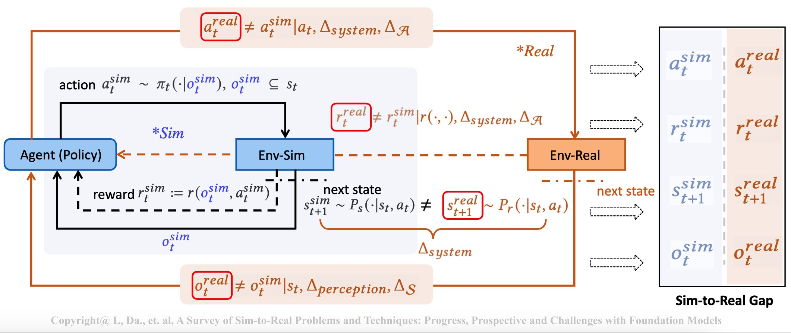
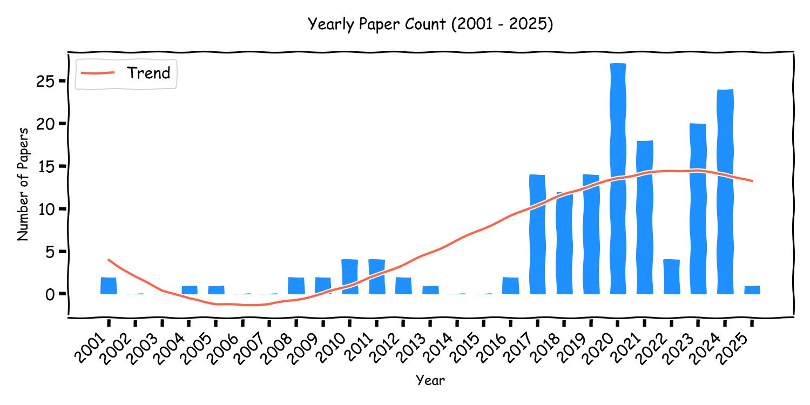

# AwesomeSim2Real

## Sim-to-Real-Paper-Collection


In the paper collection, we collected RL-based sim-to-real papers published in the recent years (201x-202x) on top conferences and journals, and categorize based on the research domains, namely simulators, robotics, transportations and others.




- [Sim-to-Real Paper Collection](#sim-to-real-paper-collection)
  - [Surveys and Simulators](#surveys-and-simulators)
    - [Survey Papers](#survey-papers)
    - [Environments and Benchmarks](#environments-and-benchmarks)
      - [Robotics Environments](#robotics-environments)
      - [Robotics Benchmarks](#robotics-benchmarks)
      - [Transportation Environments](#transportation-environments)
      - [Transportation Benchmarks](#transportation-benchmarks)
      - [Recommender System Environments](#recommender-system-environments)
      - [Recommender System Benchmarks](#recommender-system-benchmarks)
      - [Other Environments](#other-environments)
      - [Other Benchmarks](#other-benchmarks)
  - [Technique Papers](#technique-papers)
    - [Obeservation](#obeservation)
    - [Action](#action)
    - [Transistion](#transistion)
    - [Reward](#reward)


## Surveys and Simulators

### Survey Papers
1. **A Survey on Sim-to-Real Transfer Methods for Robotic Manipulation**. *Pitkevich, Andrei and Makarov, Ilya*. IEEE 22nd Jubilee International Symposium on Intelligent Systems and Informatics (SISY). 2024. [link](https://www.researchgate.net/publication/385575540_A_Survey_on_Sim-to-Real_Transfer_Methods_for_Robotic_Manipulation)
1. **How simulation helps autonomous driving: A survey of sim2real, digital twins, and parallel intelligence**. *Hu, Xuemin and Li, Shen and Huang, Tingyu and Tang, Bo and Huai, Rouxing and Chen, Long*. IEEE Transactions on Intelligent Vehicles. 2023. [link](https://ieeexplore.ieee.org/document/10242366)
1. **Parallel learning: Overview and perspective for computational learning across Syn2Real and Sim2Real**. *HMiao, Qinghai and Lv, Yisheng and Huang, Min and Wang, Xiao and Wang, Fei-Yue*. IEEE/CAA Journal of Automatica Sinica. 2023. [link](https://ieeexplore.ieee.org/document/10057176)
1. **A Brief Survey of Sim2Real Methods for Robot Learning**. *Dimitropoulos, Konstantinos and Hatzilygeroudis, Ioannis and Chatzilygeroudis, Konstantinos*. International Conference on Robotics in Alpe-Adria Danube Region. 2022 [link](https://link.springer.com/chapter/10.1007/978-3-031-04870-8_16)
1. **A survey of sim-to-real transfer techniques applied to reinforcement learning for bioinspired robots**. *Zhu, Wei and Guo, Xian and Owaki, Dai and Kutsuzawa, Kyo and Hayashibe, Mitsuhiro*. IEEE Transactions on Neural Networks and Learning Systems. 2021 [link](https://ieeexplore.ieee.org/document/9552429)
1. **Crossing the reality gap: A survey on sim-to-real transferability of robot controllers in reinforcement learning**. *Salvato, Erica and Fenu, Gianfranco and Medvet, Eric and Pellegrino, Felice Andrea*. IEEE Access. 2021 [link](https://ieeexplore.ieee.org/document/9606868)
1. **Sim-to-Real Transfer in Deep Reinforcement Learning for Robotics: a Survey**. *Wenshuai Zhao, Jorge Peña Queralta, Tomi Westerlund*. IEEE Symposium Series on Computational Intelligence. 2020. [link](https://ieeexplore.ieee.org/document/9308468)


### Environments and benchmarks 
#### **Robotics Environments**

1. **Delving Deeper into Out-of-Distribution Detection in Deep Neural Networks**. *Alok Sahu, Harshit Pandey, et, al.* . IEEE Robotics and Automation. 2023. [link](https://arxiv.org/abs/2301.04195) [](https://github.com/deeplearning-wisc/MCM.git)
1. **CALVIN: A Benchmark for Language-Conditioned Policy Learning for Long-Horizon Robot Manipulation Tasks**. *Oier Mees, Lukas Hermann, Erick Rosete-Beas, Wolfram Burgard.* IEEE Robotics and Automation. 2021. [link](https://arxiv.org/abs/2112.03227) [](https://github.com/mees/calvin)

1. **robosuite: A Modular Simulation Framework and Benchmark for Robot Learning**. *Yuke Zhu, Josiah Wong, Ajay Mandlekar, Roberto Martín-Martín, Abhishek Joshi, Kevin Lin, Abhiram Maddukuri, Soroush Nasiriany, Yifeng Zhu.* IEEE Robotics and Automation. 2020. [link](https://arxiv.org/abs/2009.12293)
1. **dm_control: Software and tasks for continuous control**. *Saran Tunyasuvunakool and Alistair Muldal and Yotam Doron and Siqi Liu and Steven Bohez and Josh Merel and Tom Erez and Timothy Lillicrap and Nicolas Heess and Yuval Tassa.* Software Impacts. 2020. [link](https://www.sciencedirect.com/science/article/pii/S2665963820300099)
1. **SoftGym: Benchmarking Deep Reinforcement Learning for Deformable Object Manipulation**. *Xingyu Lin, Yufei Wang, Jake Olkin, David Held* CoRL. 2020. [link](https://arxiv.org/abs/2011.07215)
1. **Assistive Gym: A Physics Simulation Framework for Assistive Robotics**. *Zackory Erickson, Vamsee Gangaram, Ariel Kapusta, C. Karen Liu, Charles C. Kemp.* International Conference on Robotics and Automation (ICRA). 2020. [link](https://arxiv.org/abs/1910.04700)
1. **Meta-World: A Benchmark and Evaluation for Multi-Task and Meta Reinforcement Learning**. *Tianhe Yu, Deirdre Quillen, Zhanpeng He, Ryan Julian, Avnish Narayan, Hayden Shively, Adithya Bellathur, Karol Hausman, Chelsea Finn, Sergey Levine* CoRL. 2019. [link](https://arxiv.org/abs/1910.10897)
1. **Continuous Adaptation via Meta-Learning in Nonstationary and Competitive Environments**. *Maruan Al-Shedivat, Trapit Bansal, Yuri Burda, Ilya Sutskever, Igor Mordatch, Pieter Abbeel.* International Conference on Learning Representations. 2017. [link](https://arxiv.org/abs/1710.03641)
1. **PyBullet: Real-Time Physics Simulation**. *Erwin Coumans and Yunfei Bai.* 2017. [link](https://pybullet.org/wordpress/)
1. **OpenAI Gym**. *Greg Brockman, Vicki Cheung, Ludwig Pettersson, Jonas Schneider, John Schulman, Jie Tang, Wojciech Zaremba.* 2016. [link](https://arxiv.org/abs/1606.01540)
1. **MuJoCo: A physics engine for model-based control**. *Emanuel Todorov, Tom Erez, Yuval Tassa.* 2012. [link](https://ieeexplore.ieee.org/document/6386109)
1. **Design and use paradigms for Gazebo, an open-source multi-robot simulator**. *Koenig, Nathan and Howard, Andrew.* 2004. [link](https://ieeexplore.ieee.org/document/1389727)

#### **Robotics Benchmarks**
1. **Robust Gymnasium: A Unified Modular Benchmark for Robust Reinforcement Learning**. *u, Shangding and Shi, Laixi and Wen, Muning and Jin, Ming and Mazumdar, Eric and Chi, Yuejie and Wierman, Adam and Spanos, Costas.* 2024. [link](https://github.com/SafeRL-Lab/Robust-Gymnasium)
1. **Humanoid-Gym: Reinforcement Learning for Humanoid Robot with Zero-Shot Sim2Real Transfer**. *Xinyang Gu, Yen-Jen Wang, Jianyu Chen.* .ICRA 2024 Workshop on Agile Robotics. 2024 [link](https://arxiv.org/abs/2404.05695)
1. **NeuronsGym: A Hybrid Framework and Benchmark for Robot Tasks with Sim2Real Policy Learning**. *Haoran Li, Shasha Liu, Mingjun Ma, Guangzheng Hu, Yaran Chen, Dongbin Zhao.* IEEE Transactions on Emerging Topics in Computational Intelligence .2024. [link](https://ieeexplore.ieee.org/document/1389727)
1. **RRLS : Robust Reinforcement Learning Suite**. *Adil Zouitine, David Bertoin, Pierre Clavier, Matthieu Geist, Emmanuel Rachelson.* 2023. [link](https://arxiv.org/abs/2406.08406)
1. **ManipulaTHOR: A Framework for Visual Object Manipulation**. *Ehsani, Kiana and Han, Winson and Herrasti, Alvaro and VanderBilt, Eli and Weihs, Luca and Kolve, Eric and Kembhavi, Aniruddha and Mottaghi, Roozbeh.* CVPR. 2021. [link](https://arxiv.org/abs/2104.11213)
1. **RLBench: The Robot Learning Benchmark & Learning Environment**. *Stephen James, Zicong Ma, David Rovick Arrojo, Andrew J. Davison.* 2019. [link](https://arxiv.org/abs/1909.12271)

#### Transportation Environments
1. **TorchDriveEnv: A Reinforcement Learning Benchmark for Autonomous Driving with Reactive, Realistic, and Diverse Non-Playable Characters**. *Jonathan Wilder Lavington, Ke Zhang, Vasileios Lioutas.* 2024. [link](https://arxiv.org/abs/2405.04491)
1. **AutoVRL: A High Fidelity Autonomous Ground Vehicle Simulator for Sim-to-Real Deep Reinforcement Learning**. *Shathushan Sivashangaran, Apoorva Khairnar, Azim Eskandarian et, al.* 2023. [link](https://arxiv.org/abs/2304.11496)
1. **Waymax: An Accelerated, Data-Driven Simulator for Large-Scale Autonomous Driving Research**. *SCole Gulino, Justin Fu, Wenjie Luo, George Tucker, Eli Bronstein et, al.* 2023. [link](https://arxiv.org/abs/2310.08710)
1. **MetaDrive: Composing Diverse Driving Scenarios for Generalizable Reinforcement Learning**. *Quanyi Li, Zhenghao Peng, Lan Feng, Qihang Zhang, Zhenghai Xue, Bolei Zhou.* 2023. [link](https://arxiv.org/abs/2109.12674)

1. **InterSim: Interactive Traffic Simulation via Explicit Relation Modeling**. *Qiao Sun and Xin Huang and Brian C. Williams and Hang Zhao.* 2022. [link](https://arxiv.org/abs/2210.14413)
1. **TrafficSim: Learning to Simulate Realistic Multi-Agent Behaviors**. *Simon Suo and Sebastian Regalado and Sergio Casas and Raquel Urtasun.* 2021. [link](https://arxiv.org/abs/2101.06557)
1. **SUMMIT: A Simulator for Urban Driving in Massive Mixed Traffic**. *Panpan Cai and Yiyuan Lee and Yuanfu Luo and David Hsu.* 2020. [link](https://arxiv.org/abs/1911.04074)
1. **SMARTS: Scalable Multi-Agent Reinforcement Learning Training School for Autonomous Driving**. *Ming Zhou, Jun Luo, Julian Villella, Yaodong Yang, David Rusu, Jiayu Miao et, al.* 2020. [link](https://arxiv.org/abs/2010.09776)
1. **Deepdrive Zero**. *Craig Quiter.* 2020. [link](https://doi.org/10.5281/zenodo.3871907)
1. **CityFlow: A Multi-Agent Reinforcement Learning Environment for Large Scale City Traffic Scenario**. *Zhang, Huichu and Feng, Siyuan and Liu, Chang and Ding, Yaoyao and Zhu et, al.* 2019. [link](http://dx.doi.org/10.1145/3308558.3314139)
1. **Highway-Env: An Environment for Autonomous Driving Decision-Making**. *Leurent, Edouard.* 2018. [link](https://github.com/eleurent/highway-env)
1. **Microscopic Traffic Simulation using SUMO**. *Lopez, Pablo Alvarez and Behrisch, Michael and Bieker-Walz, Laura and Erdmann et, al.* International Conference on Intelligent Transportation Systems (ITSC) 2018. [link](https://ieeexplore.ieee.org/document/8569938)
1. **CARLA: An open urban driving simulator**. *Dosovitskiy, Alexey and Ros, German and Codevilla, Felipe and Lopez, Antonio and Koltun, Vladlen.* CoRL 2017. [link](https://arxiv.org/abs/1711.03938)
1. **Duckietown: An open, inexpensive and flexible platform for autonomy education and research**. *Paull, Liam and Tani, Jacopo and Ahn, Heejin and Alonso-Mora, Javier and Carlone, Luca and Cap, Michal et, al.* 2017. [link](https://ieeexplore.ieee.org/document/7989179)


#### **Recommender System Environments**

1. **Recsim: A configurable simulation platform for recommender systems**. *Eugene Ie, Chih-wei Hsu, Martin Mladenov, Vihan Jain, Sanmit Narvekar, Jing Wang, Rui Wu, Craig Boutilier.* 2019. [link](https://arxiv.org/abs/1909.04847)
1. **Reinforcement Learning for Slate-based Recommender Systems: A Tractable Decomposition and Practical Methodology**. *Eugene Ie, Vihan Jain, Jing Wang, Sanmit Narvekar, Ritesh Agarwal, Rui Wu, Heng-Tze Cheng, Morgane Lustman, Vince Gatto, Paul Covington, Jim McFadden, Tushar Chandra, Craig Boutilier.* 2019. [link](https://arxiv.org/abs/1905.12767)
1. **RecoGym: A Reinforcement Learning Environment for the problem of Product Recommendation in Online Advertising**. *David Rohde and Stephen Bonner and Travis Dunlop and Flavian Vasile and Alexandros Karatzoglou.* 2018. [link](https://arxiv.org/abs/1808.00720)
1. **Virtual-Taobao: Virtualizing Real-world Online Retail Environment for Reinforcement Learning**. *Jing-Cheng Shi, Yang Yu, Qing Da, Shi-Yong Chen, An-Xiang Zeng.* 2018. [link](https://arxiv.org/abs/1805.10000)

#### **Recommender System Benchmarks**

1. **KuaiSim: A Comprehensive Simulator for Recommender Systems**. *Kesen Zhao, Shuchang Liu, Qingpeng Cai, Xiangyu Zhao, Ziru Liu, Dong Zheng, Peng Jiang, Kun Gai.* 2023. [link](https://arxiv.org/abs/2309.12645)
1. **Sim-to-Real Interactive Recommendation via Off-Dynamics Reinforcement Learning**. *Wu, Junda and Xie, Zhihui and Yu, Tong and Li, Qizhi and Li, Shuai.* 2021. [link](https://offline-rl-neurips.github.io/2021/pdf/50.pdf)
1. **RL4RS: A Real-World Dataset for Reinforcement Learning based Recommender System**. *Kai Wang, Zhene Zou, Minghao Zhao, Qilin Deng, Yue Shang, Yile Liang, Runze Wu, Xudong Shen, Tangjie Lyu, Changjie Fan.* 2021. [link](https://arxiv.org/abs/2110.11073)


#### **Other Environments**
1. **OpenAI Gym Retro**. *OpenAI*. 2018. [link](https://openai.com/index/gym-retro/)
1. **AI2-THOR: An Interactive 3D Environment for Visual AI**. *Eric Kolve, Roozbeh Mottaghi, Winson Han, Eli VanderBilt, Luca Weihs, Alvaro Herrasti, Matt Deitke, Kiana Ehsani, Daniel Gordon, Yuke Zhu, Aniruddha Kembhavi, Abhinav Gupta, Ali Farhadi*. 2017. [link](https://arxiv.org/abs/1712.05474)
1. **DeepMind Lab**. *Charles Beattie, Joel Z. Leibo, Denis Teplyashin, Tom Ward, Marcus Wainwright, Heinrich Küttler, Andrew Lefrancq, Simon Green, Víctor Valdés, Amir Sadik, Julian Schrittwieser, Keith Anderson, Sarah York, Max Cant, Adam Cain, Adrian Bolton, Stephen Gaffney, Helen King, Demis Hassabis, Shane Legg, Stig Petersen*. 2016. [link](https://arxiv.org/abs/1612.03801)
1. **The Arcade Learning Environment: An Evaluation Platform for General Agents**. *Marc G. Bellemare, Yavar Naddaf, Joel Veness, Michael Bowling*.2013. [link](https://arxiv.org/abs/1207.4708)
#### **Other Benchmarks**
1. **Benchmarking Safe Exploration in Deep Reinforcement Learning**. *Alex Ray, Joshua Achiam, Dario Amodei*. 2019. [link](https://openai.com/index/benchmarking-safe-exploration-in-deep-reinforcement-learning/)
1. **EnergyPlus: creating a new-generation building energy simulation program**. *Crawley, Drury B and Lawrie, Linda K and Winkelmann, Frederick C and Buhl, et, al*. 2001. [link](https://www.sciencedirect.com/science/article/abs/pii/S0378778800001146)


## Technique Papers


#### **Observation**

**Domain Randomization**
1. **Learning Vision-Based Bipedal Locomotion for Challenging Terrain**. *Helei Duan, Bikram Pandit, Mohitvishnu S. Gadde, Bart Van Marum, Jeremy Dao,Chanho Kim, and Alan Fern.*. IEEE International Conference on Robotics and Automation (ICRA). 2024. [link](https://arxiv.org/abs/2309.14594)
1. **Learning to Manipulate Anywhere: A Visual Generalizable Framework For Reinforcement Learning**. *Zhecheng Yuan, Tianming Wei, Shuiqi Cheng, Gu Zhang, Yuanpei Chen, Huazhe Xu*. 2024. [link](https://arxiv.org/abs/2407.15815)
1. **DROPO: Sim-to-real transfer with offline domain randomization**. *Gabriele Tiboni, Karol Arndt, Ville Kyrki
*. Robotics and Autonomous Systems. 2023. [link](https://arxiv.org/abs/2201.08434)
1. **Bridging the Reality Gap Between Virtual and Physical Environments Through Reinforcement Learning**. *Mahesh Ranaweera, Qusay H. Mahmoud et, al*. IEEE Access. 2023. [link](https://ieeexplore.ieee.org/document/10054009)
1. **Solving Rubik's Cube with a Robot Hand**. *S OpenAI et, al*. CoRR. 2019. [link](https://arxiv.org/abs/1910.07113)
1. **Asymmetric Actor Critic for Image-Based Robot Learning**. *Lerrel Pinto, Marcin Andrychowicz, Peter Welinder, Wojciech Zaremba, Pieter Abbeel*. CoRR. 2017. [link](https://ieeexplore.ieee.org/abstract/document/10077454)
1. **Domain Randomization for Transferring Deep Neural Networks from Simulation to the Real World**. *Josh Tobin, Rachel Fong, Alex Ray, Jonas Schneider, Wojciech Zaremba, Pieter Abbeel*. IEEE/RSJ International Conference on Intelligent Robots and Systems. 2017. [link](https://arxiv.org/abs/1703.06907)

**Domain Adaptation**

1. **Domain adaption as auxiliary task for sim-to-real transfer in vision-based neuro-robotic control**. *Connor Gade, Jan-Gerrit Habekost and Stefan Wermter*. Proceedings of the International Joint Conference on Neural Networks. 2024. [link](https://www.researchgate.net/publication/382452596_Domain_Adaption_as_Auxiliary_Task_for_Sim-to-Real_Transfer_in_Vision-based_Neuro-Robotic_Control)
1. **Unsupervised adversarial domain adaptation for sim-to-real transfer of tactile images**. *Xingshuo Jing, Kun Qian, Tudor Jianu, Shan Luo*. IEEE Transactions on Instrumentation and Measurement. 2023. [link](https://ieeexplore.ieee.org/document/10106009)
1. **MIC: Masked image consistency for context-enhanced domain adaptation**. *Lukas Hoyer, Dengxin Dai, Haoran Wang, Luc Van Gool*. CVPR. 2023. [link](https://ieeexplore.ieee.org/document/10203852)
1. *Sim-to-real domain adaptation for lane detection and classification in autonomous driving**. *Chuqing Hu, Sinclair Hudson, Martin Ethier, Mohammad Al-Sharman, Derek Rayside, William Melek*. IEEE Intelligent Vehicles Symposium (IV). 2022. [link](https://ieeexplore.ieee.org/document/9827450)
1. **Retinagan: An object-aware approach to sim-to-real transfer**. *Daniel Ho, Kanishka Rao, Zhuo Xu, Eric Jang, Mohi Khansari, Yunfei Bai*. ICRA. 2021. [link](https://ieeexplore.ieee.org/document/9561157)
1. **Bi-directional domain adaptation for sim2real transfer of embodied navigation agents**. *Joanne Truong, Sonia Chernova, Dhruv Batra*. IEEE Robotics and Automation Letters. 2021. [link](https://arxiv.org/abs/2011.12421)
1. **Da4event: towards bridging the sim-to-real gap for event cameras using domain adaptation**. *Mirco Planamente, Chiara Plizzari, Marco Cannici, Marco Ciccone, Francesco Strada, Andrea Bottino, Matteo Matteucci, Barbara Caputo*. IEEE Robotics and Automation Letters. 2021. [link](https://arxiv.org/abs/2103.12768)
1. **Sim-to-real visual grasping via state representation learning based on combining pixel-level and feature-level domain adaptation**. *Youngbin Park, Sang Hyoung Lee, Il Hong Suh*. ICRA. 2021. [link](https://ieeexplore.ieee.org/document/9561302)
1. **Rl-cyclegan: Reinforcement learning aware simulation-to-real**. *Kanishka Rao, Chris Harris, Alex Irpan, Sergey Levine, Julian Ibarz, Mohi Khansari
*. 2020. [link](https://arxiv.org/abs/2011.03148)
1. **Coupled real-synthetic domain adaptation for real-world deep depth enhancement**. *Xiao Gu, Yao Guo, Fani Deligianni, Guang-Zhong Yang*. IEEE Transactions on Image Processing. 2020. [link](https://ieeexplore.ieee.org/document/9076884)
1. **Self-supervised sim-to-real adaptation for visual robotic manipulation**. *Rae Jeong, Yusuf Aytar, David Khosid, Yuxiang Zhou, Jackie Kay, Thomas Lampe, Konstantinos Bousmalis, Francesco Nori*. ICRA. 2020. [link](https://ieeexplore.ieee.org/document/9197326)
1. **Sensor transfer: Learning optimal sensor effect image augmentation for sim-to-real domain adaptation**. *Alexandra Carlson, Katherine A Skinner, Ram Vasudevan, Matthew Johnson-Roberson*. IEEE Robotics and Automation Letters. 2019. [link](https://arxiv.org/abs/1809.06256)
1. **Vr-goggles for robots: Real-to-sim domain adaptation for visual control**. *Jingwei Zhang, Lei Tai, Peng Yun, Yufeng Xiong, Ming Liu, Joschka Boedecker, Wolfram Burgard*. IEEE Robotics and Automation Letters. 2019. [link](https://arxiv.org/abs/1802.00265)
1. **Unsupervised reverse domain adaptation for synthetic medical images via adversarial training**. *Faisal Mahmood, Richard Chen, Nicholas J Durr*. IEEE transactions on medical imaging. 2018. [link](https://arxiv.org/abs/1711.06606)
1. **Using simulation and domain adaptation to improve efficiency of deep robotic grasping**. *Konstantinos Bousmalis, Alex Irpan, Paul Wohlhart, Yunfei Bai, Matthew Kelcey, Mrinal Kalakrishnan, Laura Downs, Julian Ibarz, Peter Pastor, Kurt Konolige, others*. ICRA. 2018. [link](https://ieeexplore.ieee.org/document/8460875)
1. **Unsupervised pixel-level domain adaptation with generative adversarial networks**. *Konstantinos Bousmalis, Nathan Silberman, David Dohan, Dumitru Erhan, Dilip Krishnan*. CVPR. 2017. [link](https://ieeexplore.ieee.org/document/8099501)

**Sensor Fusion**

1. **Quantifying the sim2real gap for GPS and IMU sensors**. *Ishaan Mahajan, Huzaifa Unjhawala, Harry Zhang, Zhenhao Zhou, Aaron Young, Alexis Ruiz, Stefan Caldararu, Nevindu Batagoda, Sriram Ashokkumar, Dan Negrut*. 2024. [link](https://arxiv.org/abs/2403.11000)
1. **World model based sim2real transfer for visual navigation**. *Chen Liu, Kiran Lekkala, Laurent Itti* 2023. [link](https://arxiv.org/abs/2310.18847)
1. **Longitudinal vehicle speed estimation for four-wheel-independently-actuated electric vehicles based on multi-sensor fusion**. *Xiaolin Ding, Zhenpo Wang, Lei Zhang, Cong Wang*. IEEE Transactions on Vehicular Technology. 2020. [link](https://ieeexplore.ieee.org/document/9204583)
1. **LiDAR Object Detection and-Sensor Fusion in Simulation Environments Sensor modelling towards advancements in Real2Sim-Sim2Real**. *Christopher Höglind, Mahan Vahid Roudsari*. 2020. [link](https://odr.chalmers.se/items/f604fa2f-b3e9-4e78-8e78-486f933fe311)
1. **A sim2real deep learning approach for the transformation of images from multiple vehicle-mounted cameras to a semantically segmented image in bird’s eye view**. *Lennart Reiher, Bastian Lampe, Lutz Eckstein*. IEEE International Conference on Intelligent Transportation Systems (ITSC). 2020. [link](https://arxiv.org/abs/2005.04078)
1. **Sensor fusion for robot control through deep reinforcement learning**. *Steven Bohez, Tim Verbelen, Elias De Coninck, Bert Vankeirsbilck, Pieter Simoens, Bart Dhoedt*. IEEE/RSJ International Conference on Intelligent Robots and Systems (IROS). 2017. [link](https://ieeexplore.ieee.org/document/8206048)

**Foundation Models**

1. **InfiniteWorld: A Unified Scalable Simulation Framework for General Visual-Language Robot Interaction**. *Pengzhen Ren, Min Li, Zhen Luo, Xinshuai Song, Ziwei Chen, Weijia Liufu, Yixuan Yang, Hao Zheng, Rongtao Xu, Zitong Huang, others*.2024. [link](https://arxiv.org/abs/2412.05789)
1. **Natural Language Can Help Bridge the Sim2Real Gap**. *Albert Yu, Adeline Foote, Raymond Mooney, Roberto Martín-Martín*. 2024. [link](https://arxiv.org/abs/2405.10020)
1. **Synthetic Vision: Training Vision-Language Models to Understand Physics**. *Vahid Balazadeh, Mohammadmehdi Ataei, Hyunmin Cheong, Amir Hosein Khasahmadi, Rahul G Krishnan*. 2024. [link](https://arxiv.org/abs/2412.08619)
1. **Segment as You Wish--Free-Form Language-Based Segmentation for Medical Images**. *Longchao Da, Rui Wang, Xiaojian Xu, Parminder Bhatia, Taha Kass-Hout, Hua Wei, Cao Xiao*. 2024. [link](https://arxiv.org/abs/2410.12831)
1. **LLM-Optic: Unveiling the Capabilities of Large Language Models for Universal Visual Grounding**. *Haoyu Zhao, Wenhang Ge, Ying-cong Chen*. 2024. [link](https://arxiv.org/abs/2405.17104)
1. **ChatGPT Label: Comparing the Quality of Human-Generated and LLM-Generated Annotations in Low-resource Language NLP Tasks**. *Arbi Haza Nasution, Aytug Onan*. IEEE Access. 2024. [link](https://ieeexplore.ieee.org/document/10534765)
1. **Dinov2: Learning robust visual features without supervision**. *Maxime Oquab, Timothée Darcet, Théo Moutakanni, Huy Vo, Marc Szafraniec, Vasil Khalidov, Pierre Fernandez, Daniel Haziza, Francisco Massa, Alaaeldin El-Nouby, others*. [link](https://arxiv.org/abs/2304.07193)
1. **Gpt-4 technical report**. *Josh Achiam, Steven Adler, Sandhini Agarwal, Lama Ahmad, Ilge Akkaya, Florencia Leoni Aleman, Diogo Almeida, Janko Altenschmidt, Sam Altman, Shyamal Anadkat, others*. 2023. [link](https://arxiv.org/abs/2303.08774)


#### **Action**

**Action Space Scale**

1. **Safety-Driven Deep Reinforcement Learning Framework for Cobots: A Sim2Real Approach**. *Ammar N Abbas, Shakra Mehak, Georgios C Chasparis, John D Kelleher, Michael Guilfoyle, Maria Chiara Leva, Aswin K Ramasubramanian*.  IEEE/IFAC International Conference on Control, Decision, and Information Technologies (CoDIT). 2024. [link](https://arxiv.org/abs/2407.02231)      
1. **Fear Field: Adaptive constraints for safe environment transitions in Shielded Reinforcement Learning**. *Haritz Odriozola Olalde, Nestor Arana-Arexolaleiba*. 2023. [link](https://ceur-ws.org/Vol-3505/paper_3.pdf)
1. **Sim-to-real transfer for vision-and-language navigation**. *Peter Anderson, Ayush Shrivastava, Joanne Truong, Arjun Majumdar, Devi Parikh, Dhruv Batra, Stefan Lee*. 2021. [link](https://arxiv.org/abs/2011.03807)
1. **Safe reinforcement learning via shielding**. *Mohammed Alshiekh, Roderick Bloem, Ruediger Ehlers, Bettina Könighofer, Scott Niekum, Ufuk Topcu*. 2018. [link](https://arxiv.org/abs/1708.08611)

**Action Delay**

1. **Dynamic Modeling for Reinforcement Learning with Random Delay**. *Yalou Yu, Bo xia, Minzhi Xie, Zhiheng Li, Xuwqian Wang*. ICANN . 2024. [link](https://link.springer.com/chapter/10.1007/978-3-031-72341-4_26)
1. **Dynamic collaborative optimization of end-to-end delay and power consumption in wireless sensor networks for smart distribution grids**. *Wei Sun, Lei Zhang, Qiushuo Lv, Zhi Liu, Weitao Li, Qiyue Li*. Computer communications. 2023. [link](https://www.sciencedirect.com/science/article/abs/pii/S0140366423000543)
1. **Acting in delayed environments with non-stationary markov policies**. *Esther Derman, Gal Dalal, Shie Mannor*. [link](https://arxiv.org/abs/2101.11992)
1. **Revisiting state augmentation methods for reinforcement learning with stochastic delays**. *Somjit Nath, Mayank Baranwal, Harshad Khadilkar*. CIKM. 2021. [link](https://arxiv.org/abs/2108.07555)
1. **Utilizing reinforcement learning to autonomously mange buffers in a delay tolerant network node**. *Elizabeth Harkavy, Marc Sanchez Net*. IEEE Aerospace Conference. 2020. [link](https://ieeexplore.ieee.org/document/9172453)
1. **Reinforcement learning framework for delay sensitive energy harvesting wireless sensor networks**. *Hanan Al-Tous, Imad Barhumi*. IEEE Sensors Journal. 2020. [link](https://ieeexplore.ieee.org/document/9292079)
1. **Reinforcement learning with random delays**. *Yann Bouteiller, Simon Ramstedt, Giovanni Beltrame, Christopher Pal, Jonathan Binas*. ICLR. 2020. [link](https://arxiv.org/abs/2010.02966)
1. **Delay-aware VNF scheduling: A reinforcement learning approach with variable action set**. *Junling Li, Weisen Shi, Ning Zhang, Xuemin Shen*. IEEE Transactions on Cognitive Communications and Networking. 2020. [link](https://ieeexplore.ieee.org/document/9075271)
1. **Challenges of real-world reinforcement learning**. *Gabriel Dulac-Arnold, Daniel Mankowitz, Todd Hester*. 2019. [link](https://arxiv.org/abs/1904.12901)
1. **Mvfst-rl: An asynchronous rl framework for congestion control with delayed actions**. *Viswanath Sivakumar, Olivier Delalleau, Tim Rocktäschel, Alexander H. Miller, Heinrich Küttler, Nantas Nardelli, Mike Rabbat, Joelle Pineau, Sebastian Riedel*. 2019. [link](https://arxiv.org/abs/1910.04054)
1. **Reinforcement learning based VNF scheduling with end-to-end delay guarantee**. *Junling Li, Weisen Shi, Ning Zhang, Xuemin Sherman Shen*. IEEE/CIC International Conference on Communications in China (ICCC). 2019. [link](https://ieeexplore.ieee.org/document/8855889)
1. **At human speed: Deep reinforcement learning with action delay**. *Vlad Firoiu, Tina Ju, Josh Tenenbaum*. 2018. [link](https://arxiv.org/abs/1810.07286)
1. **Hierarchical decision and control for continuous multitarget problem: Policy evaluation with action delay**. *Jiangcheng Zhu, Jun Zhu, Zhepei Wang, Shan Guo, Chao Xu*. IEEE transactions on neural networks and learning systems. 2018. [link](https://ieeexplore.ieee.org/document/8401524)
1. **Reinforcement learning for pivoting task**. *Rika Antonova, Silvia Cruciani, Christian Smith, Danica Kragic*. 2017. [link](https://arxiv.org/abs/1703.00472)
1. **Habits, action sequences and reinforcement learning**. *Amir Dezfouli, Bernard W Balleine*. European Journal of Neuroscience. 2012. [link](https://pmc.ncbi.nlm.nih.gov/articles/PMC3325518/)
1. **Control delay in reinforcement learning for real-time dynamic systems: A memoryless approach**. *Erik Schuitema,  Lucian Buşoniu, Robert Babuška, Pieter Jonker*. IEEE/RSJ International Conference on Intelligent Robots and Systems. 2010. [link](https://ieeexplore.ieee.org/document/5650345)

**Action Uncertainty**

1. **Efficient action robust reinforcement learning with probabilistic policy execution uncertainty**. *Guanlin Liu, Zhihan Zhou, Han Liu, Lifeng Lai*. 2023. [link](https://arxiv.org/abs/2307.07666)
1. **Action advising with advice imitation in deep reinforcement learning**. *Ercument Ilhan, Jeremy Gow, Diego Perez-Liebana*. 2021. [link](https://arxiv.org/abs/2104.08441)
1. **Uncertainty-aware action advising for deep reinforcement learning agents**. *Felipe Leno Da Silva, Pablo Hernandez-Leal, Bilal Kartal, Matthew E Taylor*. 2020. [link](https://cdn.aaai.org/ojs/6036/6036-13-9261-1-10-20200513.pdf)
1. **Safe reinforcement learning with model uncertainty estimates**. *Björn Lütjens, Michael Everett, Jonathan P. How*. ICRA . 2019. [link](https://arxiv.org/abs/1810.08700)
1. **Action robust reinforcement learning and applications in continuous control**. *Chen Tessler, Yonathan Efroni, Shie Mannor*. 2019. [link](https://arxiv.org/abs/1901.09184)

**Foundation Models**

1. **RLingua: Improving Reinforcement Learning Sample Efficiency in Robotic Manipulations With Large Language Models**. *Liangliang Chen, Yutian Lei, Shiyu Jin, Ying Zhang, Liangjun Zhang*. IEEE Robotics and Automation Letters. 2024. [link](https://arxiv.org/abs/2403.06420)
1. **Local Policies Enable Zero-shot Long-horizon Manipulation**. *Murtaza Dalal, Min Liu, Walter Talbott, Chen Chen, Deepak Pathak, Jian Zhang, Ruslan Salakhutdinov*. 2024. [link](https://arxiv.org/abs/2410.22332)
1. **robosuite: A modular simulation framework and benchmark for robot learning**. *Yuke Zhu, Josiah Wong, Ajay Mandlekar, Roberto Martín-Martín, Abhishek Joshi, Soroush Nasiriany, Yifeng Zhu*. 2020. [link](https://arxiv.org/abs/2009.12293)

#### **Transition**

**Domain Randomization**

1. **Sim-to-real learning for bipedal locomotion under unsensed dynamic loads**. *Jeremy Dao, Kevin Green, Helei Duan, Alan Fern, Jonathan Hurst*. ICRA. 2022. [link](https://arxiv.org/abs/2204.04340)
1. **Understanding domain randomization for sim-to-real transfer**. *Xiaoyu Chen, Jiachen Hu, Chi Jin, Lihong Li, Liwei Wang*. 2021. [link](https://arxiv.org/abs/2110.03239)
1. **Active Domain Randomization**. *Bhairav Mehta, Manfred Diaz, Florian Golemo, Christopher J. Pal, Liam Paull*. PMLR. 2021. [link](https://arxiv.org/abs/1904.04762)
1. **Crossing the gap: A deep dive into zero-shot sim-to-real transfer for dynamics**. *Eugene Valassakis, Zihan Ding, Edward Johns*. IEEE/RSJ International Conference on Intelligent Robots and Systems (IROS). 2020. [link](https://ieeexplore.ieee.org/document/9341617)
1. **Domain randomization for transferring deep neural networks from simulation to the real world**. *Josh Tobin, Rachel Fong, Alex Ray, Jonas Schneider, Wojciech Zaremba, Pieter Abbeel*. IEEE/RSJ International Conference on Intelligent Robots and Systems (IROS). 2017. [link](https://ieeexplore.ieee.org/document/8202133)

**Domain Adaptation**

1. **A brief review of domain adaptation**. *Abolfazl Farahani, Sahar Voghoei, Khaled Rasheed, Hamid R Arabnia*. Advances in data science and information engineering: proceedings from ICDATA 2020 and IKE 2020. 2021. [link](https://arxiv.org/abs/2010.03978)
1. **Adversarial-learned loss for domain adaptation**. *Minghao Chen, Shuai Zhao, Haifeng Liu, Deng Cai*. AAAI Conference on Artificial Intelligence. 2020. [link](https://arxiv.org/abs/2001.01046)
1. **Conditional adversarial domain adaptation**. *Mingsheng Long, Zhangjie Cao, Jianmin Wang, Michael I Jordan*. Advances in neural information processing systems. 2018. [link](https://arxiv.org/abs/1705.10667)
1. **Multi-adversarial domain adaptation**. *Zhongyi Pei, Zhangjie Cao, Mingsheng Long, Jianmin Wang*. 2018. [link](https://arxiv.org/abs/1809.02176)
1. **Adversarial discriminative domain adaptation**. *Eric Tzeng, Judy Hoffman, Kate Saenko, Trevor Darrell*. IEEE Conference on Computer Vision and Pattern Recognition (CVPR). 2017. [link](https://ieeexplore.ieee.org/document/8099799)

**Grounding Methods**

1. **Uncertainty-aware Grounded Action Transformation towards Sim-to-Real Transfer for Traffic Signal Control**. *Longchao Da, Hao Mei, Romir Sharma, Hua Wei*. 62nd IEEE Conference on Decision and Control (CDC). 2023. [link](https://arxiv.org/abs/2307.12388)
1. **Reinforced grounded action transformation for sim-to-real transfer**. *Haresh Karnan, Siddharth Desai, Josiah P Hanna, Garrett Warnell, Peter Stone*. International Conference on Intelligent Robots and Systems (IROS) . 2020. [link](https://arxiv.org/abs/2008.01279)
1. **Stochastic grounded action transformation for robot learning in simulation**. *Siddharth Desai, Haresh Karnan, Josiah P Hanna, Garrett Warnell, Peter Stone*. IEEE/RSJ International Conference on Intelligent Robots and Systems (IROS). 2020. [link](https://ieeexplore.ieee.org/document/9340780)
1. **An imitation from observation approach to transfer learning with dynamics mismatch**. *Siddharth Desai, Ishan Durugkar, Haresh Karnan, Garrett Warnell, Josiah Hanna, Peter Stone*. Advances in Neural Information Processing Systems. 2020. [link](https://arxiv.org/abs/2008.01594)      
1. **Grounded action transformation for robot learning in simulation**. *Josiah Hanna, Peter Stone*. Thirty-First AAAI Conference on Artificial Intelligence. 2017. [link](https://ojs.aaai.org/index.php/AAAI/article/view/11044)

**LLM-Enhanced Approaches**

1. **Prompt to Transfer: Sim-to-Real Transfer for Traffic Signal Control with Prompt Learning**. *Longchao Da, Minquan Gao, Hao Mei, Hua Wei*. Proceedings of the AAAI Conference on Artificial Intelligence. 2017. [link](https://arxiv.org/abs/2308.14284)

#### **Reward**

**Reward Shaping**
1. **A simple framework for intrinsic reward-shaping for rl using llm feedback**. *Alex Zhang, Ananya Parashar, Dwaipayan Saha*. 2024. [link](https://alexzhang13.github.io/assets/pdfs/Reward_Shaping_LLM.pdf)
1. **Reward design with language models**. *Minae Kwon, Sang Michael Xie, Kalesha Bullard, Dorsa Sadigh*. 2023. [link](https://arxiv.org/abs/2303.00001)
1. **Adaptive Reinforcement Learning with LLM-augmented Reward Functions**. *Alex Place*. Authorea Preprints. 2023. [link](https://www.techrxiv.org/users/707008/articles/692063-adaptive-reinforcement-learning-with-llm-augmented-reward-functions)

**LLM-Based Reward Design**

1. **CurricuLLM: Automatic Task Curricula Design for Learning Complex Robot Skills using Large Language Models**. *Kanghyun Ryu, Qiayuan Liao, Zhongyu Li, Koushil Sreenath, Negar Mehr*. 2024. [link](https://arxiv.org/abs/2409.18382)
1. **EvoPrompting: language models for code-level neural architecture search**. *Angelica Chen, David Dohan, David So*. Advances in Neural Information Processing Systems. 2024. [link](Nohttps://arxiv.org/abs/2302.14838ink)
1. **Accessing gpt-4 level mathematical olympiad solutions via monte carlo tree self-refine with llama-3 8b**. *Di Zhang, Xiaoshui Huang, Dongzhan Zhou, Yuqiang Li, Wanli Ouyang*. 2024. [link](https://arxiv.org/abs/2406.07394)


# The Research Trend in Sim2Real RL



# Cite

If you find AwesomeSim2real and our survey paper useful for your research or development, please cite our [paper](xxxxxxx).

```
@article{xxx,
  title={xxx: xxx},
  author={xxxx},
  journal={arXiv preprint arXiv:xxx},
  year={2025}
}
```
